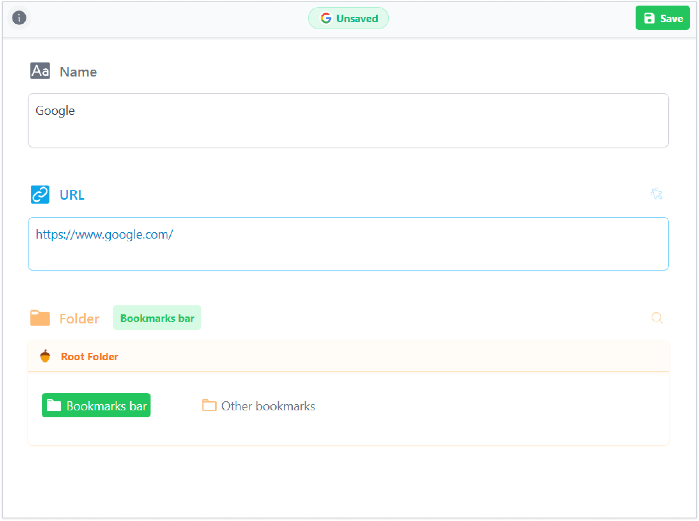

# Nut Mark
Nut Mark is a browser extension to help you collect bookmarks more easily.

:bulb: check out the [Introduction Page](https://nutmark.benbinbin.com/) for more information.

:clapper: check out the [Youtube Playlist](https://www.youtube.com/playlist?list=PLqLRbo_6ezAH4dX-RJxExHDVa956wKvTT) to see the DEMO.

## Why call "Nut Mark"
I like to collect and organize bookmarks like a squirrel hoards nuts, so I build this browser extension and call it "Nut Mark".

## Feature

Nut Mark focus on collecting bookmarks with the following features to make the process more smoothly and easily

:sparkles: Clean "dirty" URL with one click

:sparkles: Navigate freely through the directory tree

:sparkles: Quick search to find the directory to hold the bookmark

## Screenshot

## License
[MIT](https://github.com/Benbinbin/NutMark/blob/main/LICENSE)

## Feedback
If you have any problem or suggestion about this project, feel free to open an [issue](https://github.com/Benbinbin/NutMark/issues/new) in Github or contact with me by email [benthomsonbin@gmail.com](benthomsonbin@gmail.com)