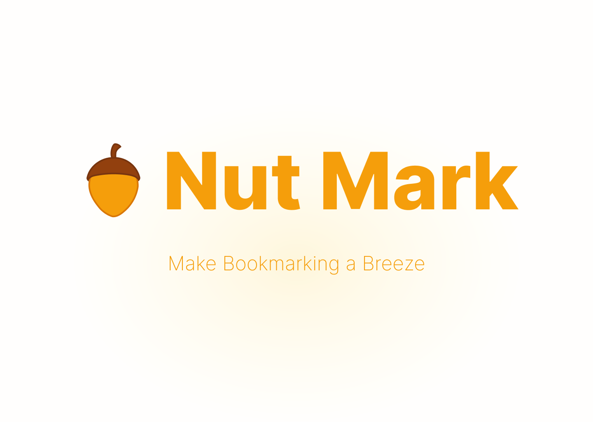

# Nut Mark
Nut Mark is a browser extension to help you collect bookmarks more easily.

## Why call "Nut Mark"
I like to collect and organize bookmarks like a squirrel hoards nuts, so I build this browser extension and call it "Nut Mark".

## Feature

Nut Mark focus on the following features to make bookmarking step more smoothly and easily

:sparkles: Clean "dirty" URL with one click

:sparkles: Quick search to find the folder to hold the bookmark

Other Bonus features

:balloon: Manage bookmarks with a user-friendly interface

:balloon: Share bookmarks in different format, like Markdown links, JSON object, images with QR Code